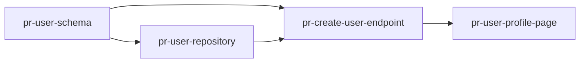

# Delivery Plan Creation

Act as a senior tech lead turning an existing SRS and Software Design Document (SDD) into a concrete, sequenced delivery plan expressed as a set of scoped pull requests (PRs), with a dependency graph, parallelization guidance, and per-PR verification criteria.

## When to Use

- An SRS and/or SDD already exist (or the user describes requirements/design well enough to plan from) and the next step is deciding *in what order and in what chunks* to build it.
- The user explicitly asks for a delivery plan, implementation plan, PR breakdown/plan, rollout plan, or work breakdown structure.
- The user wants PRs sized, sequenced, checked for dependencies, and split into parallelizable tracks rather than left as one big undifferentiated backlog.

Do not use this skill to write requirements (`stellantis-srs-create`) or produce the architecture/design (`stellantis-design-create`) — read those artifacts if they exist rather than re-deriving them. If neither exists, ask enough clarifying questions to understand scope, entities, and architecture shape before planning; don't invent design decisions silently — flag them as assumptions.

## Phase 1: Ground the Plan in Existing Artifacts

- Read the SRS (features, use cases, functional/non-functional requirements, acceptance tests) and the SDD (components, UX mockups if any, boundary contracts, data boundary if any, ADRs, functional-core/imperative-shell split, component-level tests, traceability matrix) before drafting anything — the SDD may describe a backend service, a frontend/UI app, a mobile app, a CLI, a library, or a full-stack system; ground PR scopes in whichever it actually is, not in an assumed backend shape.
- If either document is missing, ask the user for it or enough detail to substitute — do not silently fabricate requirements or architecture to fill gaps.
- Identify the natural "seams" the design already gives you: components/modules (Phase 13/14 of the SDD), UX mockups/screens (Phase 5, if the system has a UI), boundary contract items — API endpoints, UI components, CLI commands, or exported library functions (Phase 6), schema tables if the system owns persisted state (Phase 7), security/observability/performance/resilience decisions (Phase 9–12, where they drive dedicated infrastructure PRs), and ADR-driven infrastructure (Phase 3/4) — these are the raw material for PR scopes, not something to invent independently of the design.
- Note any ordering constraints already implied by the design: a datastore/schema typically must exist before code that reads/writes it; a shared library/interface typically must exist before consumers of it; a boundary contract (API, event schema, exported function signature) typically must exist (even as a stub) before a consumer (frontend, another service, a CLI) can integrate against it; a UX mockup typically settles before its corresponding UI/component contract is built against.

## Phase 2: Slice Work Into PRs

Break the full scope into a set of PRs using these rules:

- **One clear scope per PR.** Each PR should be describable in one sentence ("Adds the `users` table and repository layer", "Implements the `POST /posts` endpoint and its functional-core validation rules"). If a PR's scope needs an "and" joining two unrelated concerns, split it.
- **Size guardrail, not a hard limit.** Aim for roughly ≤1000 lines of code (net diff, excluding generated/vendored code and lockfiles) per PR. This is a guide to keep PRs reviewable — don't artificially split a cohesive, hard-to-separate change just to hit the number, and don't silently let scope creep push a PR to several times the guardrail either. When a PR is expected to exceed it, say so explicitly and explain why splitting further isn't practical (e.g., a schema migration plus its only consumer must land atomically).
- **Vertical slices over horizontal layers where possible.** Prefer a PR that delivers one thin end-to-end capability (e.g., one use case through API → core → persistence) over a PR that does "all repositories" followed by another that does "all endpoints" — vertical slices stay demonstrable (Phase 4) and reduce cross-PR coupling. Horizontal/foundational PRs (schema setup, shared auth middleware, CI scaffolding) are appropriate early in the sequence when multiple later PRs genuinely depend on them.
- **Trace every PR back to the source artifacts.** Each PR should map to one or more use cases/requirements (from the SRS) and one or more components/boundary-contract-items/tables (from the SDD). A PR with no traceable source is scope invented by the plan, not derived from requirements — call it out explicitly if that happens (e.g., necessary infrastructure/tooling work).
- Give each PR a stable slug identifier, `pr-<slug>` (e.g., `pr-user-schema`, `pr-create-post-endpoint`), never a sequential number alone — numbers get reordered as dependencies shift; slugs stay stable for cross-references.

## Phase 3: Identify Dependencies and the PR Graph

- For each PR, list the other PRs it **depends on** (must merge first) based on real technical necessity: shared schema/migration, a shared interface/contract, a shared library, or an API contract a consumer needs. Don't invent a dependency out of mere topical relatedness — two PRs touching the same component aren't necessarily ordered.
- Render the full set as a Mermaid dependency graph (`graph LR` or `graph TD`), one node per PR (using its slug), edges pointing from a dependency to the PR that depends on it:



- Check the graph for cycles — a cycle means two PRs are actually one unit of work (or the scope split in Phase 2 was wrong) and must be resolved before the plan is final, not left as a modeling curiosity.
- From the graph, derive **parallel tracks**: PRs with no dependency edge between them (directly or transitively) can be worked simultaneously by different people/agents. Call these out explicitly as a grouped list (e.g., "Track A: `pr-user-schema` → `pr-user-repository`; Track B (parallel to A): `pr-static-assets-pipeline`"), not just left implicit in the graph.
- Identify the **critical path** (the longest dependency chain) so the user knows the minimum achievable delivery sequence length even with unlimited parallel capacity.

## Phase 4: Demonstrability and Verification Per PR

Every PR must be independently demonstrable and verifiable on its own — a PR that only "sets things up" with nothing to show or check is a signal it's bundled with a later PR that should move earlier, or that a thin end-to-end slice (Phase 2) is missing.

For each PR, specify:

- **Demo**: a concrete, observable way to show the PR works — a request/response example (for an API PR), a UI interaction (for a frontend PR), a query result (for a schema/data PR), or a CLI command and its output. State it concretely enough that someone unfamiliar with the internals could follow it, not "verify it works."
- **Tests to run**: name the actual tests (existing or new) that verify the PR, cross-referencing:
  - Component-level tests from the SDD (`ct-*` IDs) that this PR should now make pass, if applicable.
  - Acceptance tests from the SRS (`at-*` IDs) that this PR fully or partially satisfies.
  - Any new tests the PR itself must add (unit tests for new functional-core logic, an integration/shell test for new I/O, a migration test), named descriptively even if the exact test file doesn't exist yet.
  - The test commands/suite to run (e.g., `npm test -- users`, `pytest tests/posts`) if the repo's conventions are known; otherwise describe the test scope in prose.
- If a PR cannot be verified without a later PR also landing (e.g., a backend endpoint with no UI yet, or a UI screen with no backing API yet), say so explicitly and demonstrate at the boundary available (e.g., a `curl`/HTTP client call, a component/unit test harness, or a CLI invocation) rather than marking it "not verifiable."

## Phase 5: PR Specification Format

Document each PR using this table row plus an expandable detail block:

Summary table (one row per PR, scannable at a glance):

| PR | Scope | Depends On | Est. LOC | Track |
| --- | --- | --- | --- | --- |

Then, one detail block per PR:

```markdown
#### pr-<slug>: <Short Title>

- **Scope**: <one-sentence description of what this PR does>
- **Traces to**: <use case(s)/requirement(s) from the SRS>, <component(s)/endpoint(s)/table(s) from the SDD>
- **Depends on**: <pr-slug, pr-slug, ...> or "None"
- **Estimated size**: <rough LOC guidance, e.g. "~400 LOC">
- **Demo**: <concrete steps to show it working>
- **Tests to run**:
  - <existing/new component tests, acceptance tests, or test commands>
- **Out of scope**: <anything adjacent that is explicitly deferred to a later PR, so scope boundaries are explicit rather than implied>
```

## Phase 6: Draft the Plan Document

Structure the delivery plan document with these sections, in this order:

1. **Introduction** — purpose, links to the source SRS/SDD, and a one-paragraph summary of the delivery approach (e.g., vertical slices, foundation-first).
2. **Assumptions** — anything inferred to make the plan concrete when the SRS/SDD left it open (deployment environment, team size/count of parallel workers, CI setup) — flagged as assumptions, not settled fact.
3. **PR Summary Table** — the scannable table from Phase 5.
4. **PR Dependency Graph** — the Mermaid graph from Phase 3, with a one-sentence caption.
5. **Parallel Tracks** — the grouped parallel-track breakdown and critical path from Phase 3.
6. **PR Details** — one detail block per PR (Phase 5), in dependency order (topologically sorted, not slug-alphabetical).
7. **Traceability** — a table confirming every SRS use case/requirement and every SDD component/endpoint/table maps to at least one PR; flag any gap explicitly rather than leaving it silently uncovered.
8. **Open Questions / Future Work** — anything explicitly out of scope for this delivery plan (e.g., a phase 2 feature set), so it's clear it was considered and deliberately excluded.

## Style and Discipline

- Keep PR scopes and dependencies grounded in the actual SRS/SDD content — don't invent requirements or architecture to make the plan look more complete.
- Prefer tables for anything list-like (PR summary, traceability) and Mermaid for the dependency graph, consistent with the other Stellantis planning skills.
- When a PR's estimated size is a guess (no existing codebase to measure against), say "estimated" explicitly rather than presenting it as measured fact.
- Keep the plan in sync with the SRS/SDD: if either changes materially after the plan is drafted, revisit affected PRs (scope, dependencies, traceability) in the same pass rather than leaving the plan stale.

## Delivering the Result

- Default file location, unless the user specifies otherwise: `docs/plan/Delivery-Plan.md`.
- Confirm the SRS/SDD (or equivalent detail) is available before drafting; if key inputs are missing, ask rather than guessing silently.
- After creating the document, briefly summarize what was produced (PR count, number of parallel tracks, critical path length, any traceability gaps found) rather than repeating the full content back in chat.
- Do not silently invent PRs with no traceable source in the requirements/design — call out any necessary-but-unrequested infrastructure work explicitly as such.
