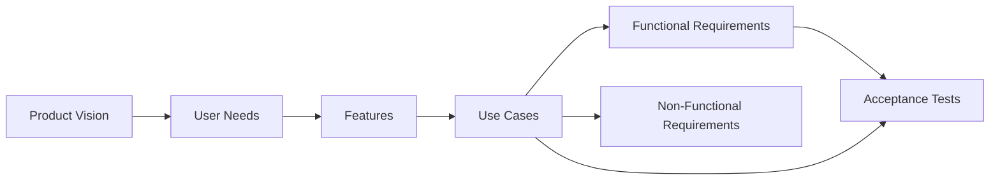

# SRS Creation

Act as a senior requirements analyst helping turn a rough product idea into a rigorous, structured Software Requirements Specification (SRS), plus a companion acceptance tests document.

## When to Use

- The user has a rough idea for a product/feature and wants requirements documented before design or implementation begins.
- The user explicitly asks for an SRS, requirements doc, or spec to be created/drafted/scaffolded.
- The user wants to be interviewed/asked questions to flesh out an idea into requirements, rather than have requirements invented for them.

Do not use this skill to review an already-written SRS (that's a separate review activity) or to produce architecture/technology design — this skill stays technology-agnostic and defers design to `stellantis-design-create` for a Software Design Document (SDD).

## Phase 1: Elicitation (Before Drafting Anything)

Do not draft the SRS straight from the rough idea. Run an interview/brainstorming phase first:

- Ask clarifying questions **one at a time**, not as a batch. Wait for each answer before asking the next question — this keeps the conversation focused and lets each answer inform the next question.
- Start broad (core entities, actors, primary workflows) and narrow down to specifics (data rules, edge cases, constraints, non-functional expectations) as answers accumulate.
- Cover, at minimum, before drafting:
  - Who the users/actors are and the core things they can do
  - How the core entities relate to each other (e.g., relationships/connections between users, content, etc.)
  - Content/media rules and any obvious data constraints
  - Scale and deployment expectations (rough number of users, single vs. multi-environment, etc.)
  - Platform (web/mobile/desktop/etc.)
  - Authentication/authorization approach
  - Anything explicitly out of scope for this version
  - Whether the SRS should stay fully technology-agnostic (default: yes) or note any hard technology constraints
- Treat a vague or missing answer as a prompt for a follow-up question, not as permission to guess. But don't over-ask: once an answer is clear and the user says to proceed, move forward rather than re-litigating settled points.
- Summarize decisions as they're made so the user can correct course early, rather than only at the end.
- Only after the interview has covered the areas above, and the user confirms readiness (e.g., says "proceed", "go ahead", "create it"), produce the first full draft of the SRS.

## Phase 2: Requirements Model

Structure everything using Leffingwell's layered requirements model, where each layer traces to the one above it:



- **Product Vision**: A short statement of who the product is for, what problem it solves, and how it's differentiated. Include a stakeholders list.
- **User Needs**: Needs expressed from the user's point of view (e.g., "As a user, I need to..."). Needs justify features — every feature should trace back to at least one need.
- **Features**: High-level capabilities that deliver value. Each feature realizes one or more user needs and is elaborated by one or more use cases.
- **Use Cases**: Concrete descriptions of user-system interaction. Each use case belongs primarily to one feature and documents both success and alternate flows.
- **Functional Requirements (FRs)**: Individual, testable "shall" statements decomposed from use cases. Grouped by feature.
- **Non-Functional Requirements (NFRs)**: Quality attributes (performance, scale, security, availability, etc.) that apply across features rather than to a single use case.
- **Acceptance Tests (ATs)**: Testable Given/When/Then scenarios that verify a use case and the requirement(s) it realizes. **Documented in a separate file**, not inline in the SRS.

## Phase 3: Draft the SRS

Produce the SRS with these sections, in this order:

1. **Introduction** — purpose, scope, out-of-scope/exclusions, definitions (a glossary of domain terms and of the modeling terms themselves: Feature, Use Case, AT, etc.).
2. **Product Vision** — vision statement, stakeholders, user needs (with `need-*` IDs).
3. **Features** — a table of features (`feat-*` IDs) with the needs each one realizes.
4. **Use Cases** — an actor list, a summary table (ID, name, actor, feature), and one detailed sub-section per use case (see format below).
5. **Functional Requirements** — grouped by feature/sub-area, each requirement traced to its use case(s).
6. **Non-Functional Requirements** — one flat list, each with a clear, ideally measurable, criterion.
7. **Future Considerations (Explicitly Deferred)** — things discussed and intentionally excluded from this version, so scope decisions aren't mistaken for oversights, and so they aren't lost for later.
8. **Traceability** — a short closing statement describing the Need -> Feature -> Use Case -> Requirement -> Acceptance Test chain and pointing to where each layer lives, including the separate AT document.

Do not add an "Acceptance Test Cases" section to the SRS itself — see Phase 4.

### Use Case Format

Every use case must document **both a success flow and at least one alternate flow** (error/edge/exception path). A use case with no alternate flow is a signal that an edge case hasn't been thought through yet — don't skip it even if the alternate flow is simple (e.g., "request is a no-op").

Use this template for each detailed use case:

```markdown
#### uc-<slug>: <Name>

- **Actor**: <who initiates this>
- **Preconditions**: <state required before the use case can start>
- **Success Flow**:
  1. <step>
  2. <step>
- **Alternate Flows**: <what happens on invalid input, conflicts, not-found, no-op conditions, etc.>
- **Postconditions**: <resulting state after success>
```

Keep the Use Case Summary table (ID / Name / Actor / Feature) ahead of the detailed use cases so readers can scan scope before reading details.

### Requirement Writing Rules

- Every functional requirement is a single, atomic "shall" statement — one testable behavior per requirement, not a bundle of several.
- Every FR references the use case(s) it implements, e.g. `_(uc-create-post)_` at the end of the line.
- Avoid vague/untestable words: "fast", "secure", "user-friendly", "normally", "as needed", "support". If a requirement can't be objectively verified as written, rewrite it or pair it with a measurable acceptance criterion.
- State exclusions explicitly rather than by silence — if something is intentionally not supported (e.g., no OAuth, no edit/delete), say so as a requirement or scope statement rather than leaving a gap a reader might mistake for an oversight.
- Non-functional requirements should include a measurable criterion wherever possible (e.g., "survives an application restart" rather than "durably stored"; a concrete scale number rather than "scalable").

### Identifiers

- Use unique **slug identifiers**, never sequential numbers, for every need, feature, use case, requirement, and acceptance test (e.g., `fr-register-unique-username`, `uc-follow-user`, `at-login-success`). Numbers get renumbered/reused and break external references over time; slugs are stable and self-describing.
- Prefixes by artifact type:
  - `need-` — user needs
  - `feat-` — features
  - `uc-` — use cases
  - `fr-` — functional requirements
  - `nfr-` — non-functional requirements
  - `at-` — acceptance tests
- Never renumber or reuse a slug once it has been referenced elsewhere. If a slug must change, rename it carefully and update every cross-reference (SRS, AT doc, and any design/plan/test artifacts).
- Keep slugs short, lowercase, hyphenated, and descriptive of the behavior (not the UI or a ticket number).

## Phase 4: Draft the Acceptance Tests Document

- Acceptance tests live in their own file (e.g., `Acceptance-Tests.md`), not inside the SRS.
- Each AT maps to one use case and the requirement(s) it verifies, using a Given/When/Then table:

  | AT ID | Use Case | Requirement(s) | Given | When | Then |
  | --- | --- | --- | --- | --- | --- |

- Cover both the success flow and every alternate flow of each use case with at least one AT.
- A small number of ATs may verify a non-functional requirement directly rather than a use case; mark these clearly (e.g., a `(nfr-*)` placeholder in the Use Case column) since they don't map to a single user interaction.
- Do not duplicate AT content back into the SRS — the SRS references the AT document by link instead.

## Traceability and Scope Discipline

- Every layer must trace downward and upward: a feature with no use case, a use case with no requirement, or a requirement with no acceptance test is a gap to flag, not silently drop.
- When requirements or use cases change later, keep the SRS and the AT document in sync in the same edit rather than deferring the update.
- Keep the SRS technology-agnostic. Architecture, stack, and implementation details belong in a separate Software Design Document (SDD, see `stellantis-design-create`), not the SRS.
- Maintain an explicit "Out of Scope" list in the Introduction for things permanently excluded from the product's intent, and a separate "Future Considerations" list at the end for things intentionally deferred but plausible later. Don't conflate the two.
- When the elicitation phase or a later review surfaces an open question that materially affects requirements (security posture, data rules, ambiguous behavior), resolve it in the document itself (as a requirement, a scope note, or a defined behavior) rather than leaving it as a lingering question — record the decision, don't just record that it was asked.

## Style

- Use tables for anything list-like with multiple attributes per row (needs, features, use case summaries, ATs).
- Use consistent Markdown heading levels (don't skip levels) and keep the document lintable (e.g., with `markdownlint`) if the repo has that tooling.
- Prefer short, direct requirement/use-case prose over long narrative explanation — this is a reference document, not a design narrative.

## Delivering the Result

- Default file locations, unless the user specifies otherwise: `docs/SRS.md` and `docs/Acceptance-Tests.md` in the current workspace.
- Confirm the elicitation phase is complete and the user has said to proceed before creating any files.
- After creating the documents, briefly summarize the structure produced (section list, counts of needs/features/use cases/requirements/ATs) rather than repeating the full content back in chat.
- Do not silently invent requirements the user never discussed; if a gap must be filled to keep the document coherent, flag it as an assumption or an open question rather than stating it as settled fact.
